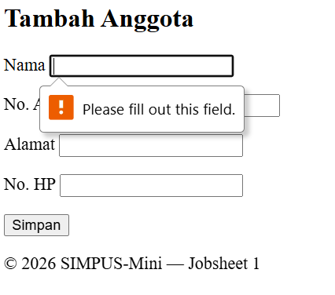

# **LAPORAN PRAKTIKUM JOBSHEET 1 - DESAIN PEMROGRAMAN WEB**
---
#### Nama  : Salsabila Keisha Ayu Setiadi
#### Kelas : TI-2F
#### NIM   : 254107020048
---

## 1. Beranda : index.html
Pada tahap pertama, membuat halaman utama atau beranda dengan nama file index.html di folder utama. File halaman utama ini diisi dengan navigasi (header), keterangan jumlah/total anggota dan buku, serta footer.

**Kode Program dapat dilihat di : [index.html](index.html)**

## 2. Tabel Daftar Buku : buku/list.html
Setelah membuat halaman utama, selanjutnya membuat tabel daftar buku yang berisi daftar buku-buku yang berupa dummy sebanyak 5 baris. Daftar buku yang diinput sebagai berikut :

| Judul | Pengarang | Tahun | Stok |
| --- | --- | --- | --- |
| Laskar Pelangi | Andrea Hirata | 2005 | 4 |
| Bumi Manusia | Pramoedya Ananta Toer | 1980 | 2 |
| Negeri 5 Menara | Ahmad Fuadi | 2009 | 0 |
| Filosofi Teras | Henry Manampiring | 2018 | 5 |
| Ronggeng Dukuh Paruk | Ahmad Tohari | 1982 | 1 |

Lalu penambahan kolom aksi yang berisi tombol Edit dan Hapus.

**Kode Program dapat dilihat di : [buku/list.html](buku/list.html)**

## 3. Form Tambah Daftar Buku : buku/tambah.html
Sudah ada tabel untuk daftar buku, setelah itu membuat halaman untuk mengisi form yang berguna untuk menambahkan daftar buku. Dalam halaman ini menggunakan elemen `<form>` dan `<input>`. Elemen `<input>` berguna sebagai kotak isian untuk mengisi form yang dibutuhkan. 

Selain itu juga terdapat opsi dropdown menggunakan elemen `<select>` dan `<option>`. 

**Kode Program dapat dilihat di : [buku/tambah.html](buku/tambah.html)**

## 4. Tabel Daftar Anggota : anggota/list.html
Selain terdapat halaman daftar buku yag ada, juga terdapat halaman untuk menampilkan daftar anggota SIMPUS-Mini. Struktur isi halaman ini kurang lebih sama dengan Tabel Daftar Buku sebelumnya, hanya merubah isi tabel yang ada dengan No. Anggota, Nama, Alamat, No. HP.

**Kode Program dapat dilihat di : [anggota/list.html](anggota/list.html)**

## 5. Form Tambah Daftar Anggota : anggota/tambah.html
Terakhir adalah halaman form untuk menambahkan daftar anggota. Struktur pada halaman ini kurang lebih juga sama dengan struktur halaman form tambah daftar buku sebelumnya. Dikarenakan pada index awal hanya ada navigasi ke 4 halaman (Beranda, Daftar Buku, Tambah Buku, dan Daftar Anggota) maka dengan adanya halaman ini, terjadi penambahan navigasi (header) di seluruh halaman termasuk halaman ini sendiri.

### Latihan Reflektif 6.5
1. Kenapa field "Alamat" dan "No. HP" tidak diberi required sedangkan "Nama" dan "No. Anggota" diberi?  
`Hal ini dikarenakan Alaman dan No. HP tidak wajib diisi. Untuk menambahkan diri hanya perlu Nomor Anggota dan Nama saja cukup.`
2. Apa yang akan terjadi (di browser) kalau kamu klik tombol "Simpan" tanpa mengisi field "Nama"? Coba buka filenya di browser dan praktikkan.  
`Jika mencoba hal tersebut maka pada web akan menunjukan bahwa field tersebut wajib untuk diisi. Pada aksi nyata (jika sudah ada backend nya), maka form tidak akan terkirim.`  

3. Form ini juga belum punya action pada tag <form>-nya — apa dampaknya saat tombol "Simpan" ditekan?  
`Karena belum ada action, maka saat ditekan "Simpan" hanya akan mereload halaman lagi.`

## Kesimpulan 
Pada jobsheet 1 ini, saya belajar terkait kerangka utama saat membuat web. Kerangka tersebut berupa header, navigasi (nav), main, dan juga footer. Selain itu saya juga belajar cara membuat tabel data serta membuat form isian. 

